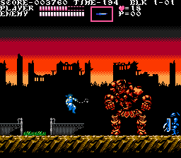

::: {#template_header}
:::

::: {#template_navigation}
:::

------------------------------------------------------------------------

::: {#gamecaption}
### CASTLEVANIA: RONDO OF BLOOD 8-BIT

C\'est un projet de jeu que j\'ai entamé en tant que projet pour le bac
en ISN. J'ai choisi de reprendre le concept d'un jeu de la saga
Castlevania peu connu, car il est sorti sur une console également peu
connue (la PC-Engine, à 16-bits), et n'est sorti qu'au Japon :
Castlevania -- Rondo of Blood. L'idée a été de refaire le jeu comme si
il était sorti quelques années auparavant, sur la console NES (Nintendo
Entertainment System). Cela implique que j'ai dû me plier aux
limitations graphiques de celle-ci : 3 couleurs par sprite, et 4 par
tile (c\'est-à-dire un carré 16x16 de decor), un nombre limité de
sprites à l\'écran, etc.

J'ai commencé à travailler sur le projet en milieu d'année scolaire car
c'était d'un intérêt personnel pour moi, j\'ai toujours voulu faire des
jeux. C'était plus un loisir que du travail en réalité, d'autant plus
que j'ai aussi fait les graphismes pour ce jeu (je fais un peu de pixel
art aussi) ainsi que la musique, en apprenant à utiliser Famitracker, un
logiciel de conception de chiptunes (musique en bip) pour la NES. Le jeu
a été programmé en Python (voulu pour le bac) avec la librairie Pygame,
il s\'agit du combat contre le dragon du niveau 1.
:::

::: {#screenshot}

{width="256"
height="224"}
{width="256"
height="224"}
{width="256"
height="224"}
{width="256"
height="224"}

:::

------------------------------------------------------------------------

::: {#gamecaption}
### FIGHTING TITANS

This is a game I worked on with a buddy from the Spriters Resource
forums, [Sketchasaurus](https://twitter.com/g33x) (he made most all of
the graphics, and thought out most the gameplay concepts, I did all the
programming). It\'s a sort of fighting game in \"fake 3D\"/\"2.5D\",
built according to NES (Nintendo Entertainment System) console
limitations.

\
I programmed it in [Haxe](https://haxe.org/), using the
[Haxeflixel](https://haxeflixel.com/) library.

\
The game features 8 playable titan characters, each with different
stats, projectile attacks, and special moves.

\
You can download the game [here]().
:::

::: {#screenshot}

{width="256" height="224"}
{width="256" height="224"}
{width="256" height="224"}
{width="256" height="224"}

:::

::: {#template_footer}
:::
