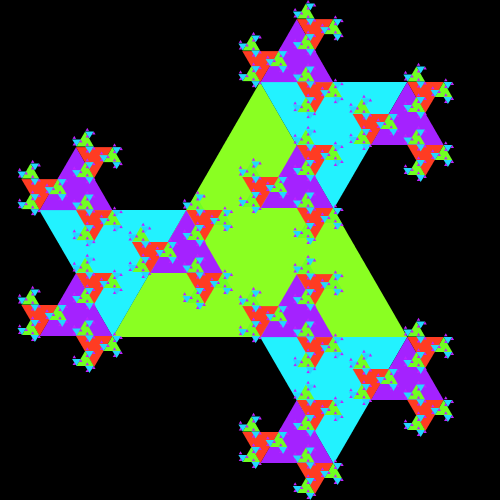
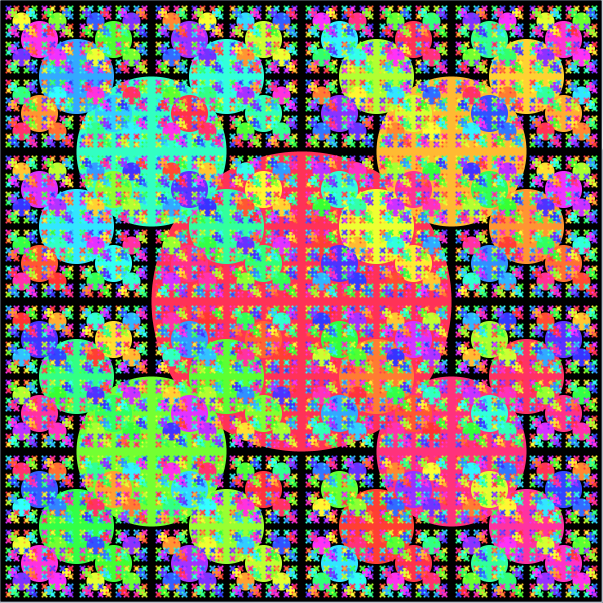
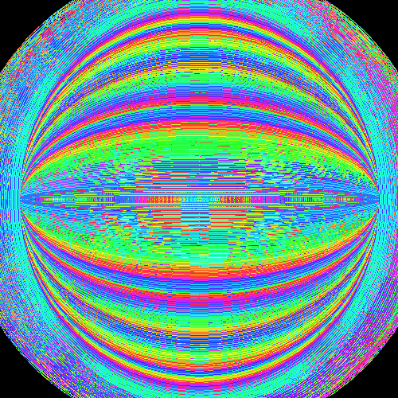
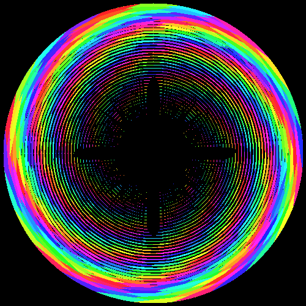
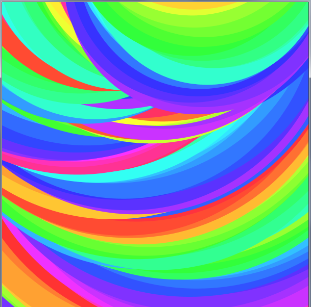

# Software Art

These are images which I generated by implementing various algorithms - mathematical art, as some call it.

I am quite fascinated with both mathematics and programming, as well as art.
It only makes sense that I would try to tap into the innate beauty of geometry.

---

### Custom rendering

Here is a zoom-out of a very interesting [complex fractal](https://en.wikipedia.org/wiki/Fractal#:~:text=Escape-time%20fractals), known as the [*burning ship fractal*](https://en.wikipedia.org/wiki/Burning_Ship_fractal), drawn here with an escape-time algorithm.

This was done as part of the "fractol" project for the 42 school. You can find the code for on [github](https://github.com/LexouDuck/42/tree/master/06-fractol)

---

### With Processing

These images were done with the Processing desktop app, written in Java.

