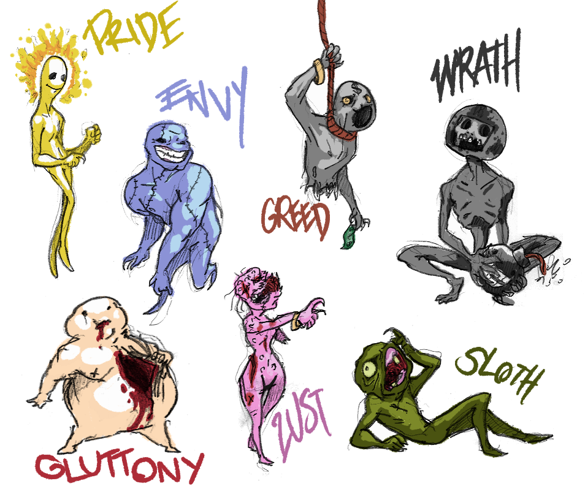

# Color Art

It is rather rare that I actually finish a sketch and decide to give it some color,
but here are some of the few such "finished" works I have made.

These are all really old (10 years ago), so they are kind of embarrassing for me to look at nowadays...
Also, these are mostly digital art for now, I ought to get my on-paper works scanned and displayed here.

---

### Original works

This is the first-ever drawing of the character which has become my mascot, the electric green mantaray:

Here is some simple coloring put above some of my [sketches](/pages/art/sketches/index.html).
Note that the large-headed zombie near the center is the only fan-art character here, the "Re-dead" from *The Legend of Zelda - Wind Waker*

This was an exercise done for a class in university - students were tasked with remaking/re-imagining an early renaissance painting: *The Annunciation, with St. Emidius* (1486) by [Carlo Crivelli](https://en.wikipedia.org/wiki/Carlo_Crivelli).

---

### Fan art works

Here is a fan art of the famous scene between Gandalf and the Balrog, from *The Lord of the Rings*:

Here is a fan art of the seven characters that represent the christian seven sins, from *The Binding of Isaac*:

This is a drawing made for a friend named "RokuGurin", way back in 2014 - this is an original character of his design.

Here is a rather old drawing of Richter Belmont from the *Castlevania* franchise, done entirely in mspaint:

Here is an experiement with lineart coloring and shading - this is supposed to be the "Elementalist" class from *Final Fantasy Tactics: Advance*.

