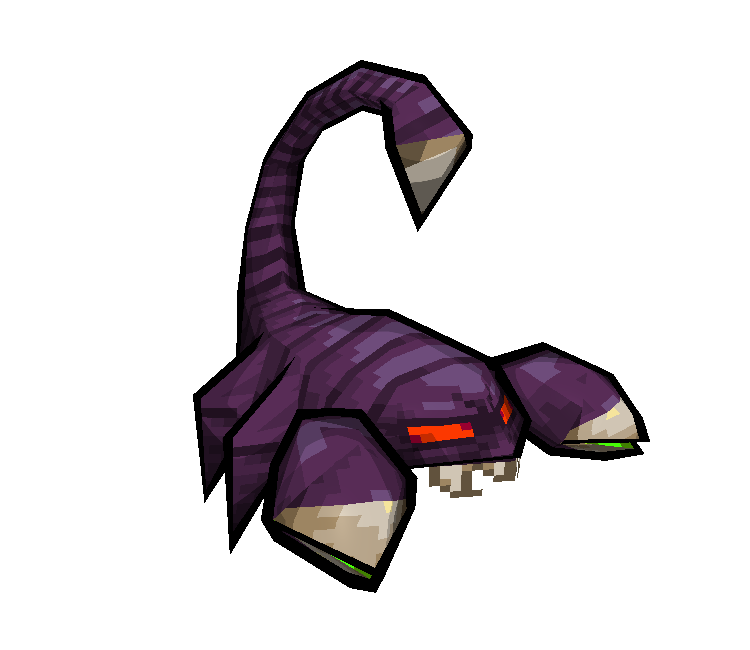

# 3D Models

Here are some of the 3D models I have made over the years.

------------------------------------------------------------------------

### Lowpoly Models

This model was made with heavy inspiration from [Kenneth Fejer](http://kennethfejer.com/3d.html)'s lowpoly modeling style.
The design of this spaceship is a throwback to *Faye Valentine*'s gunship from the popular anime *Cowboy Bebop*.

This model was made with an interesting program called [Crocotile3D](http://www.crocotile3d.com/),
which is a 3D modeling program, with a special tile-based workflow, thought out for lowpoly-pixelart-style games.
The textures are these very cool GBC-style dark souls sprites made by
[Ryumaru over at the Pixelation forums](https://pixelation.org/index.php?topic=17902.0).

------------------------------------------------------------------------

### Lowpoly Models - Nuclear Throne

This set of models was a for-fun project of mine to remake the popular
roguelike indie game [*Nuclear Throne*](#), with lowpoly 3D assets rather than 2D sprites.

{height="500"}
{height="500"}
{height="500"}
{height="500"}
{height="500"}
{height="500"}
{height="500"}
{height="500"}

------------------------------------------------------------------------

### Mid/Highpoly Models

{height="500"}
