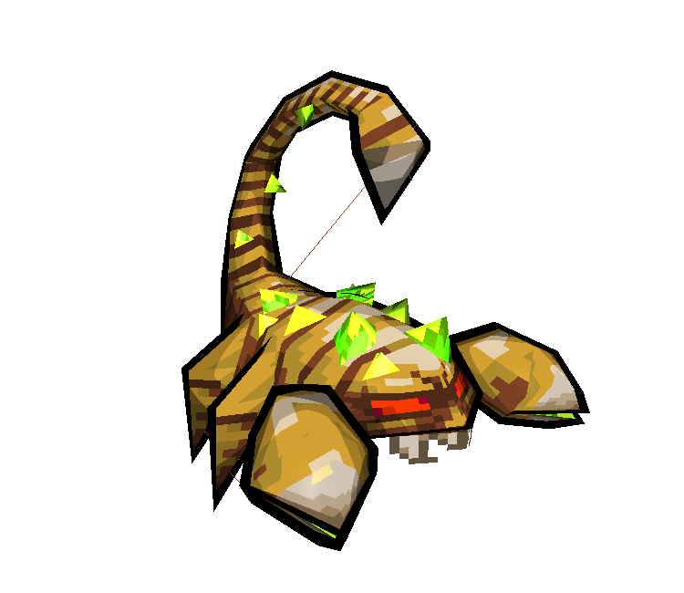
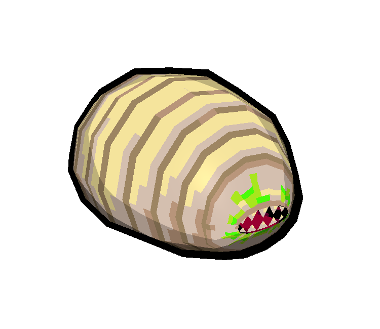

# 3D Models

Here are some of the 3D models I have made over the years.

I have interested in 3D modeling since I was a child playing video games,
in particular lowpoly models of old consoles, particularly the "PS1" or "DS" style
of models, that use unfiltered pixelart textures.

At first I experimented a little bit with [Google Sketchup](https://www.sketchup.com/),
then got the opportunity to use [3DS max](https://www.autodesk.com/products/3ds-max/overview),
until I settled on [Maya](https://www.autodesk.com/products/maya/overview) for a while,
since it is highly customizable and scriptable. Though, more recently, I have
begun to take a liking to [Blender](https://www.blender.org/) (and not just because of *AutoDe$k*'s pricing!) -
its user interface has made great progress since the early days when I first tried it.

---

### Tools & Scripts

Since I did quite a bit of model-ripping from commercial video games (for example, all the models from the [DS remake of Final Fantasy III](https://www.models-resource.com/ds_dsi/finalfantasyiii/)), I quickly realized most 3D programs have strange quirks when they import models from common interchange formats like `.obj`, `.dae`, and `.fbx`.
To fix this issue, I created a fair amount of small scripts for Maya, which can be found on [my github](https://github.com/LexouDuck/MayaUtilities).

---

### Lowpoly Models

This model was made with heavy inspiration from [Kenneth Fejer](http://kennethfejer.com/3d.html)'s lowpoly modeling style.
The design of this spaceship is a throwback to *Faye Valentine*'s gunship from the popular anime *Cowboy Bebop*.

Unfortunately, this model uses a 48x48 texture - since the size is not a power of two, sketchfab compresses/botches the texture… Here’s a GIF with a proper texture, at an appropriately small resolution:

<iframe title="Mono-Carrier Gunship" frameborder="0" allowfullscreen mozallowfullscreen="true" webkitallowfullscreen="true" allow="autoplay; fullscreen; xr-spatial-tracking" xr-spatial-tracking execution-while-out-of-viewport execution-while-not-rendered web-share width="640" height="480" src="https://sketchfab.com/models/4c037028445846f1bc68a61cc4ed2834/embed?ui_theme=dark" style="max-width:100%;">
</iframe>

##### Nuclear Throne

This set of models was a for-fun project of mine to remake the popular
roguelike indie game [*Nuclear Throne*](http://nuclearthrone.com/), with lowpoly 3D assets rather than 2D sprites.

{max-height="500"}

{max-height="500"}

<iframe title="Nuclear Throne - Crystal" frameborder="0" allowfullscreen mozallowfullscreen="true" webkitallowfullscreen="true" allow="autoplay; fullscreen; xr-spatial-tracking" xr-spatial-tracking execution-while-out-of-viewport execution-while-not-rendered web-share width="640" height="480" src="https://sketchfab.com/models/ee9e3b983c484a9b80a6628c0e4c8f5f/embed?ui_theme=dark" style="max-width:100%;">
</iframe>

{max-height="500"}

<iframe title="Nuclear Throne - Bandit" frameborder="0" allowfullscreen mozallowfullscreen="true" webkitallowfullscreen="true" allow="autoplay; fullscreen; xr-spatial-tracking" xr-spatial-tracking execution-while-out-of-viewport execution-while-not-rendered web-share width="640" height="480" src="https://sketchfab.com/models/4219ef9ea3a6427696007ff1dcfe93ae/embed?ui_theme=dark" style="max-width:100%;">
</iframe>

{max-height="500"}
{max-height="500"}

<iframe title="Nuclear Throne - Scorpion" frameborder="0" allowfullscreen mozallowfullscreen="true" webkitallowfullscreen="true" allow="autoplay; fullscreen; xr-spatial-tracking" xr-spatial-tracking execution-while-out-of-viewport execution-while-not-rendered web-share width="640" height="480" src="https://sketchfab.com/models/4b2448a164994b2288977e2d61e6c19d/embed?ui_theme=dark" style="max-width:100%;">
</iframe>

{max-height="500"}
{max-height="500"}

<iframe title="Nuclear Throne - Snow Tank" frameborder="0" allowfullscreen mozallowfullscreen="true" webkitallowfullscreen="true" allow="autoplay; fullscreen; xr-spatial-tracking" xr-spatial-tracking execution-while-out-of-viewport execution-while-not-rendered web-share width="640" height="480" src="https://sketchfab.com/models/1eb648c2a5f14a58baef7e17d4b1f4f4/embed?ui_theme=dark" style="max-width:100%;">
</iframe>

{max-height="500"}

##### Crocotile3D

This model was made with an interesting program called [Crocotile3D](http://www.crocotile3d.com/),
which is a 3D modeling program, with a special tile-based workflow, thought out for lowpoly-pixelart-style games.
The textures are these very cool *Gameboy Color* style sprites of *Dark Souls* made by
[Ryumaru, over at the Pixelation forums](https://pixelation.org/index.php?topic=17902.0).

---

### Mid/Highpoly Models

Unfortunately, I haven't made much higer-polycount models that are cool to look at...
Mostly all I've done is some boring mechanical pieces I needed to get 3D-printed.

---

### Other

I'm not sure if this really counts, but I've player thousands of hours in the physics simulator game called [Besiege](https://store.steampowered.com/app/346010/Besiege/).
I created several machines in this game and uploaded them to my [Steam creator workshop](https://steamcommunity.com/id/lexouduck/myworkshopfiles/?appid=346010) - many of them are quite successful, with thousands of downloads.
I've also programmed a mod which allows for [split-screen cameras](https://steamcommunity.com/sharedfiles/filedetails/?id=1525445027&searchtext=split+screen+camera), thus enabling local multiplayer - this was quite the programming challenge!
