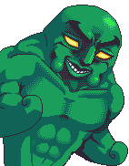
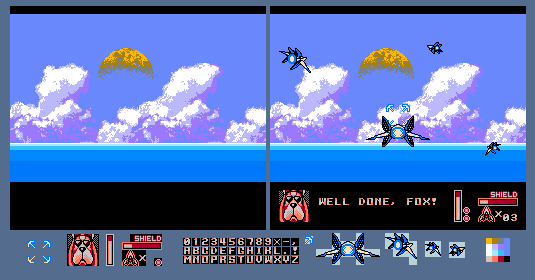
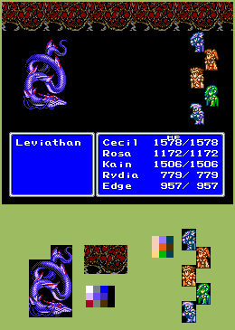

# Pixel Art

These are some of the pixel art works I've made over the years (all made entirely in mspaint).

------------------------------------------------------------------------

### Original Pieces

This was done for on contest on [Pixeljoint](https://pixeljoint.com/pixelart/96147.htm), constraints being a very limited 8-color palette (6 colors plus black and white) and a predetermined canvas size.

This one is purely monochromatic (black/white), I made this to experiment with pixel dithering patterns.

This strange sprite was made for [The Spriters' Resource Fighter game](https://www.vg-resource.com/thread-20507.html), to serve as a "character select" portait.
To poke fun at the tradition of most arcade fighting games, which is to have overly detailed character portraits,
that sometimes are quite different from how the character looks in-game. Here this idea was turned up to eleven,
by requiring that character portraits be done in a style reminiscent of *JoJo's Bizarre Adventure*.

------------------------------------------------------------------------

### Demake Mockups

These are some NES-style "demake" mockups, that I made to illustrate some of my [chiptune covers](/pages/music/chiptunes/index.html).

This piece was an experiment, to attempt to show how it might be possible
to have some background graphics displayed on the original Gameboy *Pokemon* games.

------------------------------------------------------------------------

### Fanart

Here are a couple sprits done in the style of the Gameboy Advance *Fire Emblem* games.
I have always been a big fan of these games, as one can tell from my
[Emblem Magic](/pages/tools/emblem_magic/index.html) project.

