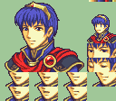
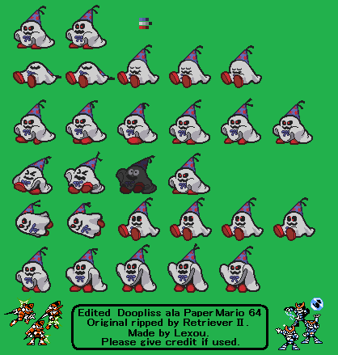
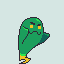
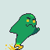
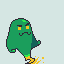
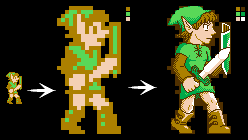
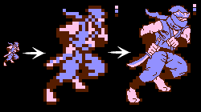

# Pixel Art

These are some of the pixel art works I've made over the years.

Since I was very young, I have been drawing - and have been fascinated with
video game sprites and backgrounds. I naturally spent quite some time getting
better at making pixelart, hanging on PixelJoint and the Spriters' Resource forums.

Pretty much all of these were made entirely in mspaint - though I have been using
other tools here and there, like [usenti](#) and [gale](#), and more recently [aseprite](#).

---

### Original Pieces

This was done for on contest on [Pixeljoint](https://pixeljoint.com/pixelart/96147.htm), constraints being a very limited 8-color palette (6 colors plus black and white) and a predetermined canvas size.

This one is purely monochromatic (black/white), I made this to experiment with pixel dithering patterns.

This one is a rather simple sprite I had at my beginnings, back in 2012.

This is one of the first characters I ever designed, originally for a sprite constest on [the Spriters' Resource](https://www.vg-resource.com/thread-13273-page-2.html), way back in 2010.

---

### Demake Mockups

These are some NES-style "demake" mockups, that I made to illustrate some of my [chiptune covers](/pages/music/chiptunes/index.html).

This piece was an experiment, to attempt to show how it might be possible
to have some background graphics displayed on the original Gameboy *Pokemon* games.

---

### Fanart

Here are a couple sprites done in the style of the Gameboy Advance *Fire Emblem* games.
I have always been a big fan of these games, as you can tell from my
[Emblem Magic](/pages/tools/emblem_magic/index.html) project.

I was also always a big fan of the *Paper Mario* games, and so I created a couple of
sprites edits, mostly to reproduce characters from *Paper Mario: The Thousand-Year Door*
in the style of the original *Paper Mario* on the Nintendo 64.

---

### The Fighters' Resource

This was a pretty cool community game project on [the Spriters' Resource forums](https://www.vg-resource.com/thread-20507.html).
Many of the regular users there had a "character reference", a mascot/avatar character to represent themselves.
Since most all of the users on the forum were big pixelart enthusiasts, a good friend of mine, [Gorsal](https://twitter.com/spritergors) made a full character sprite sheet for his own "ref" mascot, in a pretty simple style,
along with pretty extensive style guides for others to make their own "ref" mascot sprite sheets.
You can download a playable build of the game [here](https://www.vg-resource.com/thread-25022.html)

Unfortunately, I had never finished the spritesheet for my own character, only basic idle and movement animations:
- idle: 
- move forwards: 
- move backwards: 

This strange sprite was made to serve as a "character select" portait.
The idea for *The Fighters' Resource* was to poke fun at the age-old tradition of most arcade fighting games,
which is to have overly detailed character portraits, that are often quite different from how the character
actually looks in-game.
Here this idea was turned all the way up to eleven, by requiring that each of our "character select" portraits
be done in a style reminiscent of *JoJo's Bizarre Adventure*.

---

### TSRPG

Another cool community game project on [the Spriters' Resource forums](https://www.vg-resource.com/thread-23022.html).
This time instead of a fighting game using the characters/mascots of the forum's users, the goal here
was to make a silly JRPG game about the wonderful wacky world of the Spriters's Resource forums.

The rightmost sprite here is the humanoid version of my mascot character, and was done by [VirtuaBoy123](#) to be one of the enemies for the game. I decided to chip in & help out by creating the leftmost sprite - the mantaray version of my mascot.
Seeing the two side-by-side, made me want to imagine a mid-level between the two, similar to a *Pokemon* evolution line - this is why I also created the larger darker manta ray in the middle.

---

### Upscaled/revamped NES sprites

This is some of the first "custom" pixelart I had ever done, way back in 2010:
This was an old short-lived [trend](NES-revamp_Samus.png) on [the Spriters' Resource forums](#), wherein you take an old-school
NES sprite, scale up its size times four, and choose 3 new colors to add to it.

A good friend of mine, [Chris2balls](https://pixeljoint.com/p/14966.htm), had made several of these: [Ice Climber](https://pixeljoint.com/pixelart/101853.htm), [Balloon Fight](https://pixeljoint.com/pixelart/101855.htm), [Getsu Fuuma](https://pixeljoint.com/pixelart/101854.htm)

And finally, here are the 2 (unfinished) ones that I made, though they pale in comparison to the previous examples...

