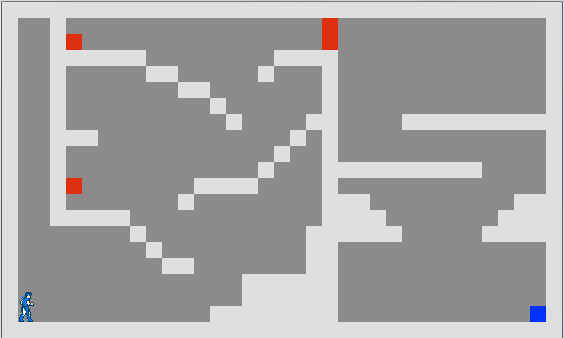
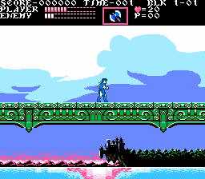
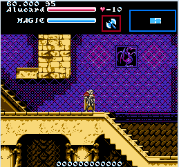
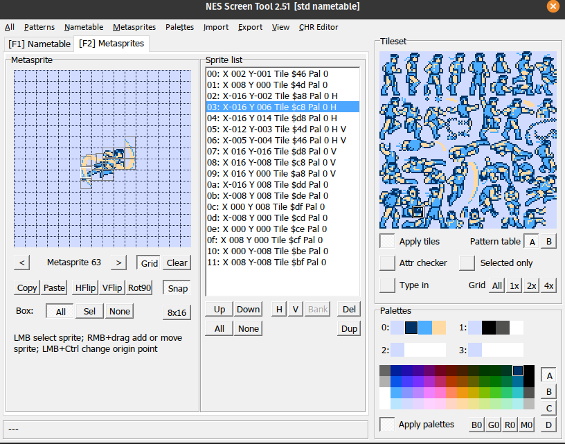
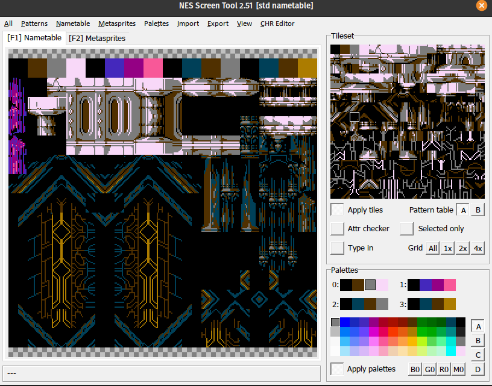
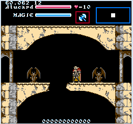
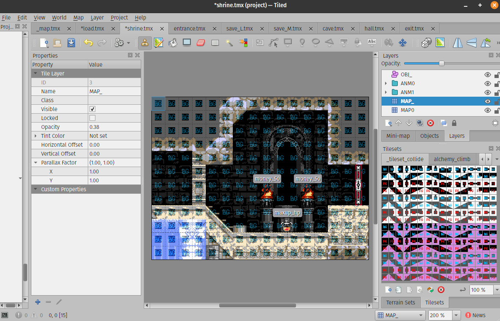

# Castlevania: Symphony of Blood

**STATUS:** In-progress

This is the first game project I worked on for myself, in 2015.

The idea is to mesh together the best parts of *Castlevania - Rondo of Blood*
with *Castlevania - Symphony of the Night*, in the shape of a "demake" (like a remake,
but for an earlier console, with lower specs).

---

### The "why"

This game initially started as the project for my end-of-highschool exam, since
I was lucky enough to be in a school where, in my last year of highschool,
I was given the option to select an (experimental) programming class.

I started working on the project in the middle of the school year (long before the exam)
because it was of personal interest to me, I always wanted to make games.
It was more of a hobby to me, especially since I did everything by myself:
- the graphics (I had been using [mspaint](https://en.wikipedia.org/wiki/Microsoft_Paint#Windows_7_and_8.x) from a young age)
- the music (I learned how to use [Famitracker](http://famitracker.com/) to create NES-accurate chiptunes)
- the coding (programmed in [Python](https://www.python.org/) - which was taught in the class - using the [Pygame](https://www.pygame.org/) library)

I chose to "demake" a game I am fond of, which I think is quite underrated: *Castlevania - Rondo of Blood*.
This game is not very well-known because it was released on a console that few people own (or even know), 
the *PC-Engine* - also known as the *Turbografx16* in North America -
and also, this game was only ever released in Japan.
Although, the *Castlevania* series is a well-known franchise, and there was a game that
loosely resembled this one, that was released in the west: *Castlevania - Dracula X*.
Unfortunately *Castlevania - Dracula X* is very different from *Castlevania - Rondo of Blood*,
and most people who have played both generally agree that it is by far the lesser of the two games.

The idea was to "demake" the game (*i.e.* to remake it under lower specs),
in other words, to re-imagine the game, as if it had been released
a few years earlier, on the NES (Nintendo Entertainment System).
During the lifespan of the NES console, *Castlevania* was one of the truly big names,
alongside classics like *Super Mario*, *Legend of Zelda*, *Metroid*, *Mega Man*, etc.
This would have perhaps allowed the game to enjoy greater accessibility, and so, greater success.
Demaking the game implies that I had to comply with the technical limitations of this console.
The NES is not a very powerful system, it has many limitations, in terms of power, video, audio, etc.

Here are some mockups I made at the very start, to have an idea of what it might look like:

{.screencap width="256" height="224"}
{.screencap width="256" height="224"}
{.screencap width="256" height="224"}

And here is a GIF of the initial engine, which was essentially my first programming project.

Originally, for the high school exam, I just implemented the battle against the first boss
(or, to be more precise, one of the two "first bosses", since this game features branching paths).
I figured that this "lake serpent" enemy would be easier to implement, since it required little
pixelart sprite work, just a couple of small distinct parts of its body - and in fact,
making the body parts follow the head of the snake was a fun programming challenge in and of itself.

Of course, this first game engine I had built had several bugs (including some that made the boss trivial),
the player character was clunky to control, and many other issues regarding Python made me abandon it.

Several years later, after working on several game projects here and there, and after learning several
other programming languages, I decided to restart, and hopefully finish this project.

I made progress with creating a new engine in [Haxe](https://haxe.org), using the [HaxeFlixel](https://haxeflixel.com/) library.
This time around, I implemented some of the skeleton enemies first.

Unfortunately, this new engine had several issues as well - it was not riddled with bugs like the first one,
but the way in which HaxeFlixel handles rendering meant that several visual tricks which are
commonplace in NES games (such as palette-swapping) were costly in terms of performance...

Around this time, I made a [chiptune](/pages/music/chiptunes/index.html) of one of my favorite songs from another, well-known game in the series: *Castlevania - Symphony of the Night*. To illustrate the chiptune's youtube video, I set out to make an NES-style mockup of *Symphony of the Night*. I noticed that a certain "Emperor Pixel" had made quite a few of these exact kind of mockup images, which you can check out here: [1](https://pixeljoint.com/pixelart/82408.htm), [2](https://pixeljoint.com/pixelart/82689.htm), [3](https://pixeljoint.com/pixelart/82857.htm)

Now, *Symphony of the Night* is pretty a different game from *Rondo of Blood*,
it is not a tough, linear, level-by-level platformer like the original *Castlevania* games.
It breaks away from the preceding formula, and instead helped to coined the "[metroidvania](https://en.wikipedia.org/wiki/Metroidvania)"
term - a platformer instead focused on exploration, backtracking and ingenuity.
The game's "metroidvania" nature makes it much easier to sidestep or avoid challenging sections,
whereas in *Rondo of Blood*, there is no easy way out (unless you play as Maria, that is...).
It seemed to me like there was definitely some "just middle" of difficulty and design between the two:
a game where the RPG stat mechanics can help a struggling/stuck player (either through simple grinding,
or some other strategy), but where there is still sufficient challenge for the player... dare I say, a souls-like ?

It also made a great deal of sense to me to mesh the two games together, simply because in terms of lore,
*Symphony of the Night* is a direct sequel to *Rondo of Blood*, occuring just a couple of years later,
and featuring many of the same characters. Furthermore, the maps of the two games have perfect overlap in many areas.

After some time passed, with renewed passion, I got to working on this project again.
And, as I did so, so too did the scope of the project increase accordingly.

### The "how"

At this point, after ending up battling against game engine libraries every time I attempted this,
I had two options as to how to develop the game. Either: make a custom engine that can imitate the NES well,
or develop an actual NES ROM in 6502 assembly. Needless to say, being experienced with C at this point,
and having built a complex fully-featured ROM-hacking tool, [Emblem Magic](/tools/emblem_magic/index.html),
I had gained some experience of assembly languages - and so I chose the first option, because assembly
really isn't my cup of tea...

What made sense was to create this custom engine in C, using [SDL2](https://www.libsdl.org/) - this would grant me
complete control over the rendering pipeline, and so complete control over performance.
It would also allow me to go beyond the (very restrictive!) limitations of the NES, especially
the kind of restrictions that most players dont immediately notice (such as having no lag,
having many sprites onscreen without flickering, background parallax scrolling, etc).
Though, I still wished to be considerate of the NES purists out there, so I added a bunch of
"NES fidelity options" to the game, for those who wish for the authentic, laggy, flickering experience.

So, I started developing this (final) engine, and made good progress.
I found the perfect tool for my needs, the [NES Screen Tool](https://shiru.untergrund.net/software.shtml), which is
experssly built to create tile-based 2bpp graphics for the NES - and it also
features a nice interface to assemble meta-sprites from multiple 8x8 sprites.

I also used the [TileReplace](https://shiru.untergrund.net/software.shtml) tool by the same fellow, to optimize tilesets
to make them fit in the limited size of an [NES nametable](https://www.nesdev.org/wiki/PPU_nametables).
Here is an example of a tileset nametable, again in the *NES Screen Tool*:

I implemented the main playable characters first: Richter, Alucard, and Maria.
Then the various menus within the "pause" screen.
Getting terrain collisions to work properly, especially with diagonally sloped tiles,
was quite the challenge.

I also found a good workflow to create maps/environments, using [Tiled](https://www.mapeditor.org/),
and I designed a custom `.map` file format, and implemented a plugin to export said files from Tiled.

I added more explorable areas, thanks to this nicer workflow.

