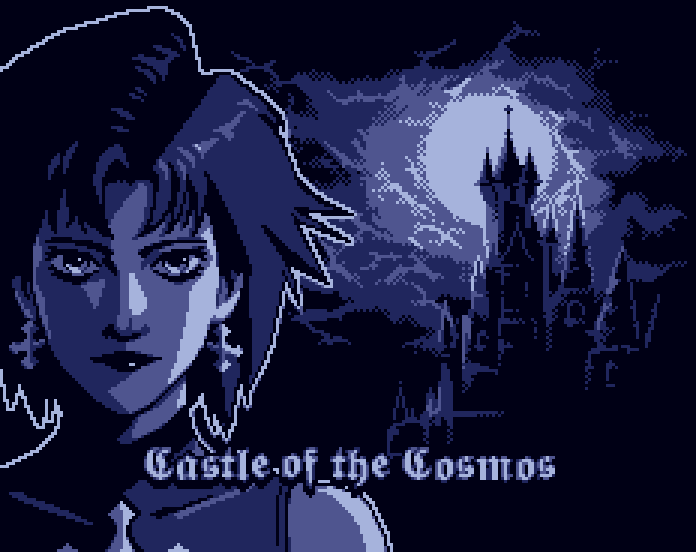
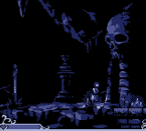
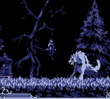
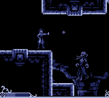
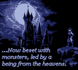

# Castle of the Cosmos

**STATUS:** ???

This game was made for the [11th GBJAM](https://itch.io/jam/gbjam-11) (Gameboy-themed gamejam), with a group of buddies I knew from my old forum-going days.

The game is a sidescrolling action platformer (similar to a Castlevania), with combat based on a projectile that gets stronger every time it bounces on a wall.

---

The gamejam lasted one week - I did not participate all that much (I simply fixed some bugs near the end of it, and made one of the chiptune songs). I hadn't ever used GameMaker before so this was an opportunity to learn on the spot.

These online pals of mine made most all of the pixelart, and music - I made one just one track.
To be more precise, we called the team [Galloway Games](https://gallowaygames.itch.io), in reference to an old forum we had going long ago.

You can play the game directly in your browser <a href="/pages/games/gamejams/castle_of_the_cosmos/game/index.html">here</a> (or download the executable), over on the [official page on itch.io](https://gallowaygames.itch.io/castle-of-the-cosmos)

Here are some screenshots of the game:

