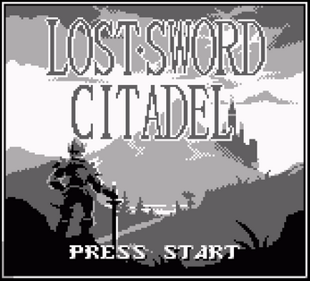
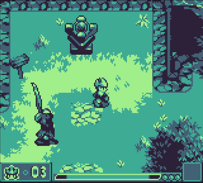
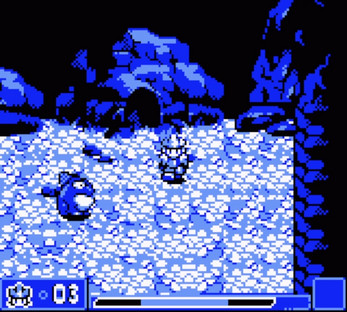
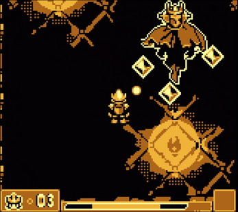
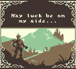
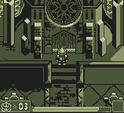

# Lost Sword Citadel

**STATUS:** ???

This game was made for the [9th GBJAM](https://itch.io/jam/gbjam-9) (Gameboy-themed gamejam), with a group of buddies I knew from my old forum-going days. We managed to get 8th place overall, with **1st place** in graphics !

The game is a top-down adventure game, with combat based on elementally-infused projectiles.

---

The gamejam lasted one week - I programmed most of it, using Unity (I also made a couple of sprites, and one of the chiptunes). I hadn't ever used Unity before so this was an opportunity to learn on the spot (I already had extensive experience using C#, though).

These online pals of mine made most all of the pixelart, and music - I made one track, and a couple of sprites.
To be more precise, we called the team [Galloway Games](#), in reference to an old forum we had going long ago.

You can play the game directly in your browser (or download the executable), over on the [official page on itch.io](https://gallowaygames.itch.io/lost-sword-citadel)

Here are some screenshots of the game:

And here are some GIFs roughly showing how it plays:

The main gameplay gimmick is that the A button shoots projectiles,
and B button locks the player's facing direction, which allows strafing.
The game has 3 orbs that the player must collect, each granting him a new
elemental projectile-modifying ability. These elemental effects vary as to
what they do (ice slows down, fire deals plenty of damage, and lightning
deals moderate damage, while periodically stunning) - these effects also
spread around to nearby enemies (and to the player!).

After the gamejam, I spent a little while fixing several glaring issues with
the game's engine, though I must admit it is quite a challenge to get a nice,
stable "fake 3D" engine in Unity (mostly due to how Unity handles collisions).

If I were to get back to working on this, the main idea I wanted to implement
was to make the key equippable items alter how the B button works.
You would start with nothing on the B button, then quickly learn the "facing-lock".
Afterwards, you could have the ability to run, to jump, to carry objects.
If this idea sounds very much like a classic Zelda game, then I can only say "guilty"
