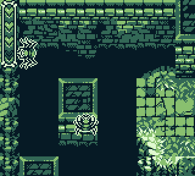
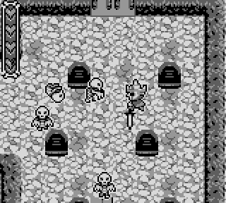
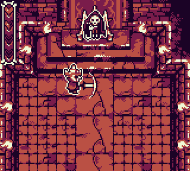

# Mask of the Reaper

**STATUS:** Done

This game was made for the [12th GBJAM](https://itch.io/jam/gbjam-12) (Gameboy-themed gamejam), with a group of buddies I knew from my old forum-going days.

The game is a top-down action/adventure game (similar to a 2D Zelda), with a capture mechanic that allows the player to take control of enemies.

---

The gamejam lasted one week - I did not participate all that much (the extent of my participation was to manage the project with a big excel spreadsheet, made one of the chiptune songs, made an enemy sprite, and more importantly, fixed several bugs as the deadline approached). I hadn't much used GameMaker before so this was an opportunity to learn on the spot.

These online pals of mine did most all of the pixelart, music, and coding.
To be more precise, we called the team [Galloway Games](https://gallowaygames.itch.io), in reference to an old forum we had going long ago.

You can play the game directly in your browser <a href="/pages/games/gamejams/mask_of_the_reaper/game/index.html">here</a> (or download the executable), over on the [official page on itch.io](https://gallowaygames.itch.io/mask-of-the-reaper)

Here are some screenshots of the game:

