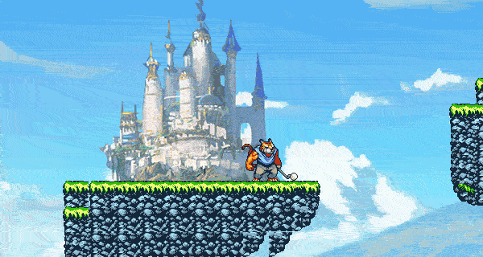

# Tiger Woods Golf Tour

**STATUS:** Done

This was a pretty silly game made with a my brother and couple of buddies from the [42 school](https://42.fr/en/homepage/), for [41st ludum dare gamejam](https://ldjam.com/events/ludum-dare/41).

It is a simple puzzle-platformer game, where you play as a large muscular tiger wielding
a golf club. The goal is to send the white golf ball into the goalpost - though the terrain
is very treacherous. To work against the terrain, the titular tiger can place (and golf)
bombs, which explode and destroy/alter the terrain.

---

- It is available for download from the [ldjam website](https://ldjam.com/events/ludum-dare/41/golf-rush)

Here is a short GIF of the gameplay:

