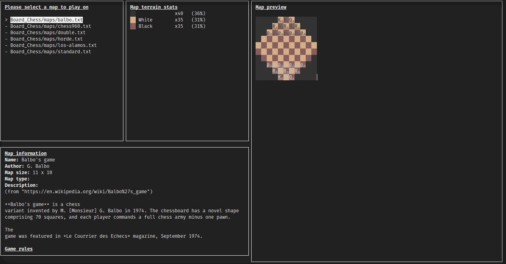
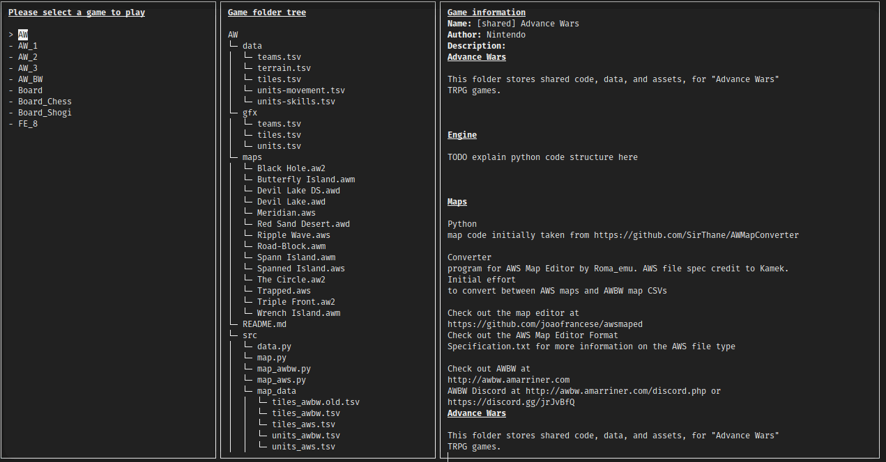

# Tactics Maker

**STATUS:** In-progress

This is more of a tool to make games, rather than a video game in and of itself.
Tactics Maker is a highly customizable, modular, data-oriented game engine and toolset,
which is specifically geared towards creating "tactics RPG" games - i.e. the kind of
strategy games that play on some sort of grid, and that are typically turn-based.

---

Think of it like this: this engine allows one to implement games ranging from simple timeless games,
like Go, Checkers, Chess, Shogi, to more complex modern SRPG/tactics games such as
Fire Emblem, Advance Wars, Final Fantasy Tactics, XCOM, etc.
In fact, reference implementations of public domain classic games like Chess and Shogi
are provided by default with Tactics Maker, to serve as useful examples for developers.

With just some `.tsv` spreadsheets, and a hundred lines of python code, you can have a
working game - the tougher task is implementing your game's frontend look & feel.

- Check it out on [Github](https://github.com/LexouDuck/Tactics-Maker)

For now, there only exists one frontend, which is (by design) very basic and commandline-based,
written directly in [Python](https://python.org/), using [curses](https://docs.python.org/3/howto/curses.html).

- Here is what a game of chess looks like in it:

- Here is what a game of mock *Advance Wars* looks like:

