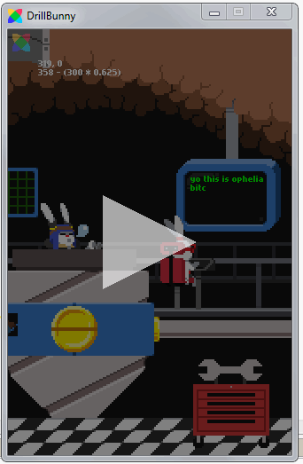

# Drill Bunny

**STATUS:** Hiatus

This was a project I worked on with the [Dream Show Adventures](#) team, around 2013.

This game was developed primarily for mobile phone platforms, it is a relatively simple
"runner"-type game, where the objective is to drill down into the earth as deep as possible,
avoiding obstacles, collecting items & powerups, aiming for that *high score*.

---

This is a game project from \~2015 that was spearheaded by *ninspriter* (a.k.a Andrew Agulto),
which originally began as a [ludum dare gamejam](https://stvr.itch.io/drill-bunny).

The extent of my participation was just to implement some menus, with some parallax scrolling.

- Here is the parallax scrolling main menu in action:

