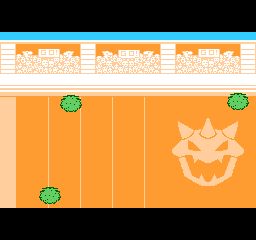
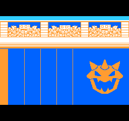
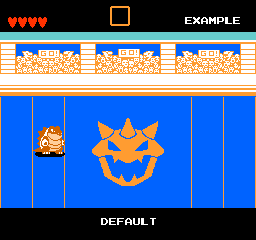
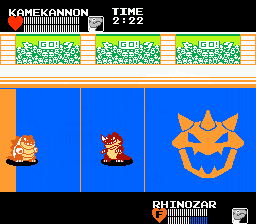
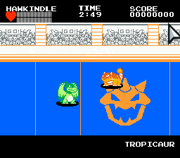
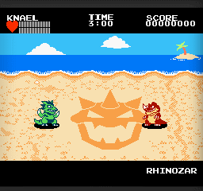
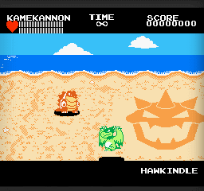

# Fighting Titans

**STATUS:** ???

This is a 2-person game project I worked on around 2016.

It is a unique combination of genres: fighting game, and beat-em-up.
The playable characters are various creatures with special powers,
and their battles are set in large arenas for humans to enjoy.

---

This is a game I worked on with a buddy from the Spriters Resource forums, [Sketchasaurus](https://twitter.com/g33x).
He made pretty much all of the graphics, and thought out most the gameplay concepts.
I did all of the programming, as well as pitching in ideas and designs.
It's a sort of fighting game in \"fake 3D\", or what some call \"2.5D\",
built according to NES (Nintendo Entertainment System) console limitations.

I programmed the game in [Haxe](https://haxe.org/), using the [Haxeflixel](https://haxeflixel.com/) library.

The game features 8 playable "titan" characters, each with different stats, projectile attacks, and special moves.

Here are some of the mockups that Sketchasaurus originally made, which made me want to work on this:

::: {#screenshot}
{.screencap width="256" height="224"}
{.screencap width="256" height="224"}
{.screencap width="256" height="224"}
{.screencap width="256" height="224"}
:::

Here are some clips of gameplay from the early test builds of the game, as it was being developed (there may be some bugs displaying in the GIF here, because the GIF capture program I used had some issues):

::: {#screenshot}
{.screencap width="256" height="224"}
{.screencap width="256" height="224"}
:::

And here are some GIFs of later test builds, after we decided to have some more interesting maps in the game:

::: {#screenshot}
{.screencap width="256" height="224"}
{.screencap width="256" height="224"}
:::
