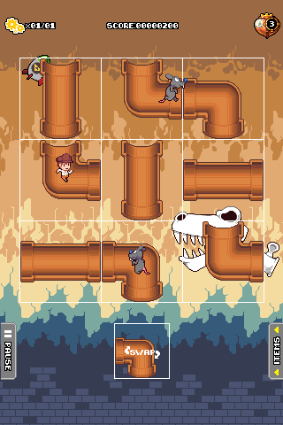
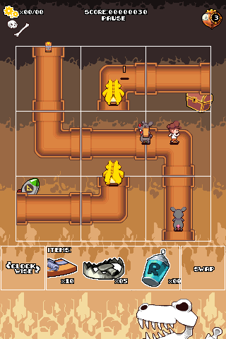
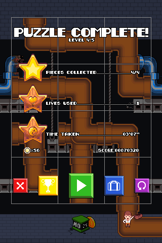
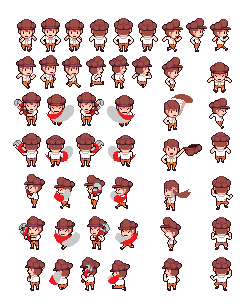

# Pipe Works

**STATUS:** Hiatus

This was a project I worked on with the [Dream Show Adventures](https://dreamshowadventures.com/) team, around 2013.

It is a puzzle game, in which the player rearranges and rotates pipes around,
to meet various level objectives. It was developed primarily for mobile phone platforms.

---

This is a game project from \~2013 that was spearheaded by *ninspriter* (a.k.a. Andrew Agulto).
Early development was documented in forum threads, as a sort of interactive devlog
(ah, the good old days internet forums... in fact, this is how I originally found out about the project).
- [TIGsource](https://forums.tigsource.com/index.php?topic=32804)
- [Spriters'Resource](https://www.vg-resource.com/showthread.php?tid=21931)

There is also a [soundcloud](https://soundcloud.com/pipeworks) channel featuring some tracks from the game.

The extent of my participation was to really just implement some menus & buttons (this is among the first projects I worked on).

- Here are some screenshots from an early build of the game:

- Here is a spritesheet showing the detailed animations of the player character:

